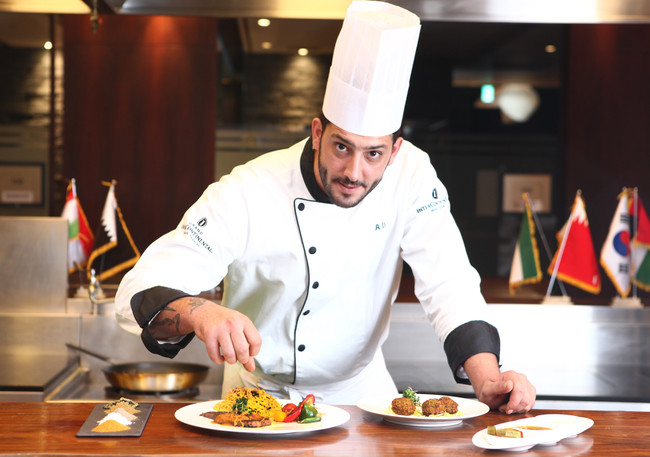

## 안녕하세요
### "hello"

# 요리하는 개발자 최준호 입니다.

>## My SNS 
> 

## My history

> ### korean culinary art school
> 2010 ~ 2012
> I learned about a variety of cooking.
> For example, I received professional training for 3 years on Korean, Chinese, Japanese, Western, and bakery.

> ### Osan.univ

